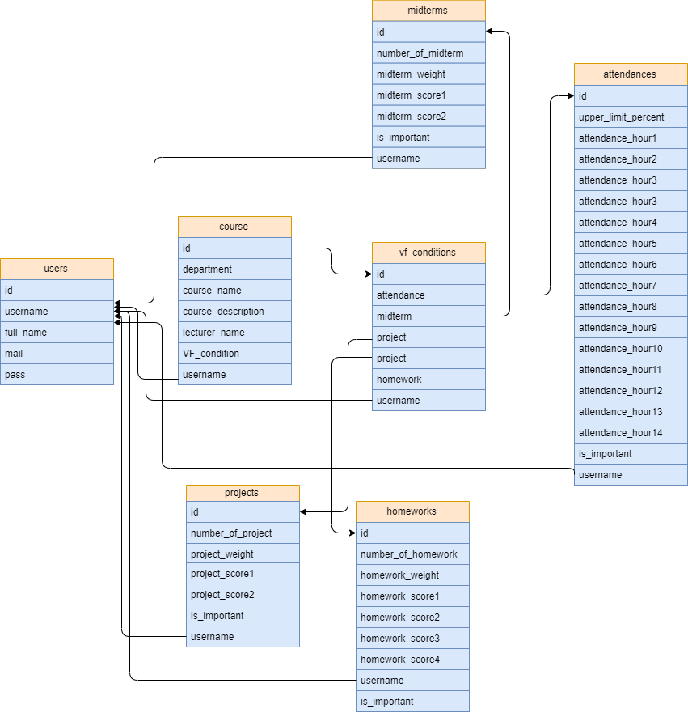

Developer Guide
===============

Database Design
---------------

   
**database design of our project**

   
   -Entity Distribution
   Red:AHMET ÖZDEMİR
   Blue:ALPER MERİÇ
   ORANGE:Together
   
.. figure:: images/ertable.png
   :scale: 70 %
   :alt: map to buried treasure
   
Code
----

**explain the technical structure of your code**

**to include a code listing, use the following example**::

   .. code-block:: python

      class Foo:

         def __init__(self, x):
            self.x = x

.. toctree::

   member1
   member2
