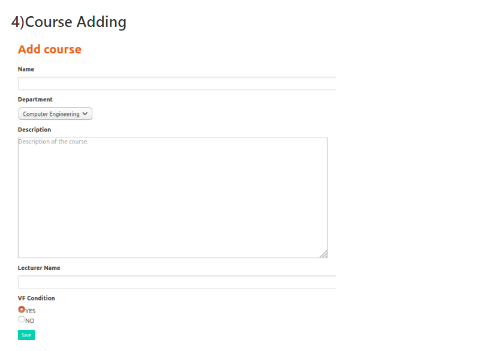
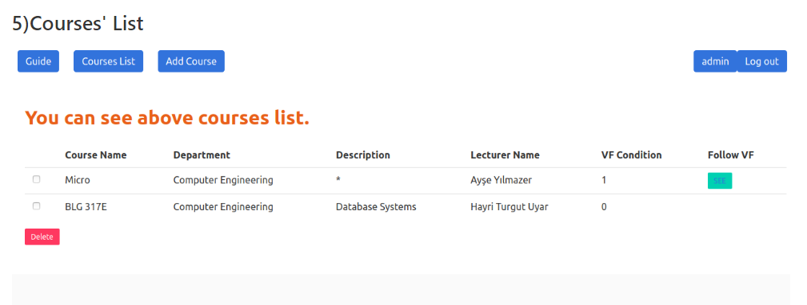

Parts Implemented by Ahmet Özdemir
================================

4.Course Adding
---------------

   
On the course adding page, you can add the course name, the description of the course, the name of the instructor, the description of the course, and whether or not there are VF requirements for the course. 

5.Course's List
---------------

   
You can see the list of all courses you have added. You can delete what you want by using the Checkbox next door. You can reach the courses with VF requirements by clicking the "SEE" button in the table.
